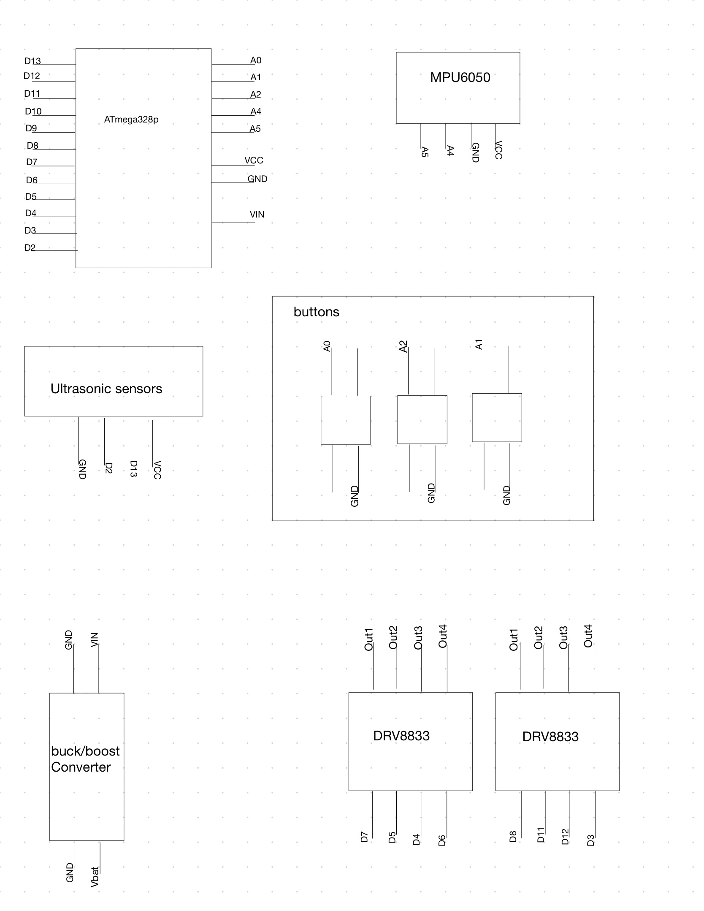

# MAE576 final project Robot

The motivation for this project comes from the MAE 576 Mechatronics course, where the goal is to build an autonomous robotic system.

I wanted to design a robot that not only avoids obstacles but also demonstrates:

- Low-level embedded control using pure register-level C  
- Real-time sensing with ultrasonic and gyroscope sensors  
- Safe operation through fault detection  
- Modular, scalable code suitable for future robotics projects  

This project also serves as a foundation for a larger-scale autonomous system I plan to build in the future.

### How the System Works 

The robot uses an ultrasonic sensor to detect objects in front of it and an MPU6050 gyroscope to detect when it is lifted or tilted beyond a safe threshold.  
Based on the selected mode (Follow or Avoid), the microcontroller processes sensor data, applies median filtering, computes safe motor commands, and drives the motors using PWM from Timer0 and Timer2.  
A reset button and status LED provide user interaction and system feedback.  
All hardware is controlled through custom drivers written in C for maximum speed and reliability.

---

### Parts Used

- Ultrasonic sensor (detects distance)
- MPU6050 gyroscope (detects rotation/tilt)
- Buck-boost converter (regulates power)
- Li-ion battery
- ATmega328P (Arduino Uno)
- DRV8833 motor drivers 
- 4 DC motors
- Mode buttons (A0 and A2)
- Reset button (A1)
- Indicator LED (Pin D10)

The robot has two modes of opperation:

1. **Follow Mode** – Robot follows objects within a safe distance around 13cm (can be changed in code)
2. **Avoid Mode** – Robot will turn left when approaching obstacles 

A hardware **reset button** allows clearing fault states and re-selecting modes.

###  **Ultrasonic Distance Measurement**  
Custom driver using Timer1 to measure the echo pulse width.In unison a median filtering is used to remove noisy measurements where it's then able to be converted from µs -> cm using physics-based constants  

###  **MPU6050 Gyroscope Integration**  
The Gyroscope reads the angular velocity and communicate the results through I²C to the ATmega328p.This is to be able to detect when the robot is lifted or tipped, where it will enter fault-safe state automatically  

###  **Motor Control**  
using PWM on Pins D3, D5, D6, D11 which are connected to Timer0 & Timer2.The direction is control by pins D4, D7, D8, D12; This allows for Modular movement functions like forward, stop, and left turn. 

###  **Mode Identifier**  
- Follow mode -> LED blinks once  
- Avoid mode -> LED blinks twice  
- No mode select -> LED is OFF

###  **Safety System**  
for Safety the robot will stop the motors from moving as soon as it gets picked up. At the same time it will turn on the LED, to indicate a fault has occured.

##  Project Limitations

While the robot performs reliably, several limitations exist:

- **No encoder feedback:** Motors run open-loop, so speed is not precisely controlled.  
- **Limited sensing:** Only forward-facing ultrasonic sensing; no side or rear detection.  
- **No IMU filtering:** MPU6050 data uses raw gyroscope values (no Kalman/filter fusion).  
- **Turning behavior is simple:** Avoid mode uses fixed-time turning rather than geometric path planning.  
- **No battery monitoring:** System assumes stable power from buck-boost but does not measure battery voltage.

with these limitations it leaves room for improvement, where these issue can be solved as well as added new features. 

# Pin out 
the follow is the pin out for all of the comomponents.

| Arduino Pin | ATmega328P Pin | Direction | Function | Notes |
|-------------|----------------|-----------|----------|-------|
| **D13 (PB5)** | PB5 | Output | Ultrasonic TRIG | Sends 10 µs pulse |
| **D2 (PD2)** | PD2 | Input | Ultrasonic ECHO | Measures echo pulse width |
| **A1 (PC1)** | PC1 | Input (Pull-up) | Reset Button | Active LOW |
| **A0 (PC0)** | PC0 | Input (Pull-up) | Follow Mode Button | Active LOW |
| **A2 (PC2)** | PC2 | Input (Pull-up) | Avoid Mode Button | Active LOW |
| **D10 (PB2)** | PB2 | Output | Fault / Status LED | Blinks for mode, solid for fault |

## Motor driver 

#### **Left Front Motor**
| Signal | Arduino Pin | Notes |
|--------|-------------|-------|
| LF_DIR | **D7 (PD7)** | Direction control |
| LF_PWM | **D5 (PD5 – OC0B)** | PWM from Timer0 |

#### **Left Back Motor**
| Signal | Arduino Pin | Notes |
|--------|-------------|-------|
| LB_DIR | **D4 (PD4)** | Direction control |
| LB_PWM | **D6 (PD6 – OC0A)** | PWM from Timer0 |

#### **Right Front Motor**
| Signal | Arduino Pin | Notes |
|--------|-------------|-------|
| RF_DIR | **D12 (PB4)** | Direction control |
| RF_PWM | **D11 (PB3 – OC2A)** | PWM from Timer2 |

#### **Right Back Motor**
| Signal | Arduino Pin | Notes |
|--------|-------------|-------|
| RB_DIR | **D8 (PB0)** | Direction control |
| RB_PWM | **D3 (PD3 – OC2B)** | PWM from Timer2 |

##  MPU6050 (I²C) Connections

| MPU6050 Pin | Connects To | Notes |
|-------------|-------------|-------|
| **SDA** | **A4** | I²C data line |
| **SCL** | **A5** | I²C clock line |
| **VCC** | 5V | Most breakout boards support 5V |
| **GND** | GND | Must share ground with Arduino |

---
